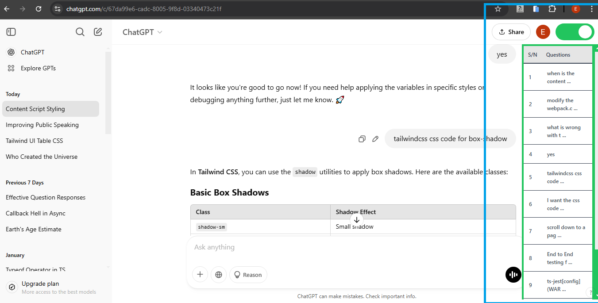

# **ChatGPT Question Log - Chrome Extension**

---

**ChatGPT Question Log** is a Chrome extension that helps you keep track of all the questions you ask an AI (like ChatGPT) during a chat session. It automatically collects your questions and organizes them in a table for easy reference.

## **Features**

- Logs all the questions you ask during a chat session.
- Displays the questions in a structured table.
- Click on a question to jump directly to where it was asked on the page.
- Enhances your workflow by making it easy to revisit past queries.

## **Screenshots**

## **Installation**

1. Download the extension files.
2. Open **Chrome** and go to `chrome://extensions/`.
3. Enable **Developer mode** (toggle in the top right corner).
4. Click **"Load unpacked"** and select the extension folder.
5. The extension is now ready to use!

## **How It Works**

1. Start a chat session in ChatGPT.
2. The extension captures each question you ask.
3. Open the **ChatGPT Question Log** popup to view your question history.
4. Click on any question in the table to navigate back to its original location in the chat.
5. Enable the toggle switch to keep the question log visible while browsing.

## **Permissions**

The extension requires access to web pages where ChatGPT AI chats **occur** to log your questions and provide navigation. It **does not** collect or store personal data.

## Privacy Policy

This Chrome extension respects your privacy. It **does not collect, store, or share any user data**.

- No personal information is stored or transmitted.
- No browsing activity is tracked.
- No third-party services are used to collect user data.

This extension operates entirely on your device, ensuring your privacy and security. If you have any questions, feel free to send a message.

## **Support & Feedback**

If you have any issues or suggestions, feel free to reach out!

---
